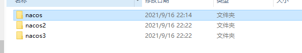

# Nacos
官网：https://nacos.io/zh-cn/docs/quick-start.html

Nacos 致力于帮助您发现、配置和管理微服务。Nacos 提供了一组简单易用的特性集，帮助您快速实现动态服务发现、服务配置、服务元数据及流量管理。

Nacos 帮助您更敏捷和容易地构建、交付和管理微服务平台。 Nacos 是构建以“服务”为中心的现代应用架构 (例如微服务范式、云原生范式) 的服务基础设施。

## 快速开始
### 从 Github 上下载源码方式
```Java
git clone https://github.com/alibaba/nacos.git
cd nacos/
mvn -Prelease-nacos -Dmaven.test.skip=true clean install -U  
ls -al distribution/target/

// change the $version to your actual path
cd distribution/target/nacos-server-$version/nacos/bin
```
### 下载编译后压缩包方式
```Java
  unzip nacos-server-$version.zip 或者 tar -xvf nacos-server-$version.tar.gz
  cd nacos/bin
```

### 启动服务器
Linux/Unix/Mac
启动命令(standalone代表着单机模式运行，非集群模式):
```Java
sh startup.sh -m standalone
```

Windows 启动命令
```Java
startup.cmd -m standalone
```
集群    启动命令
```Java
startup.cmd -m cluster
```

### 服务注册&发现和配置管理
服务注册
```Java
curl -X POST 'http://127.0.0.1:8848/nacos/v1/ns/instance?serviceName=nacos.naming.serviceName&ip=20.18.7.10&port=8080'
```

服务发现
```Java
curl -X GET 'http://127.0.0.1:8848/nacos/v1/ns/instance/list?serviceName=nacos.naming.serviceName'
```

发布配置
```Java
curl -X POST "http://127.0.0.1:8848/nacos/v1/cs/configs?dataId=nacos.cfg.dataId&group=test&content=HelloWorld"
```

获取配置
```Java
curl -X GET "http://127.0.0.1:8848/nacos/v1/cs/configs?dataId=nacos.cfg.dataId&group=test"
```
## 配置文件
### 版本依赖
```java
<!--父依赖>
 <!-- spring-cloud-alibab-dependencies -->
            <dependency>
                <groupId>com.alibaba.cloud</groupId>
                <artifactId>spring-cloud-alibaba</artifactId>
                <version>2.1.0.RELEASE</version>
                <type>pom</type>
                <scope>import</scope>
            </dependency>
            <!-- spring-cloud-dependencies -->
            <dependency>
                <groupId>org.springframework.cloud</groupId>
                <artifactId>spring-cloud-dependencies</artifactId>
                <version>Greenwich.RELEASE</version>
                <type>pom</type>
                <scope>import</scope>
            </dependency>

            <!-- spring-boot-dependencies -->
            <dependency>
                <groupId>org.springframework.boot</groupId>
                <artifactId>spring-boot-dependencies</artifactId>
                <version>2.1.3.RELEASE</version>
                <type>pom</type>
                <scope>import</scope>
            </dependency>

<!--子依赖>
        <dependency>
            <groupId>com.alibaba.cloud</groupId>
            <artifactId>spring-cloud-starter-alibaba-nacos-config</artifactId>
        </dependency>
        <dependency>
            <groupId>org.springframework.boot</groupId>
            <artifactId>spring-boot-starter-web</artifactId>
        </dependency>
```

### 配置文件
```properties
server.port=8080

spring.application.name=service1

#nacos
# 配置中心的地址
spring.cloud.nacos.config.server-addr=127.0.0.1:8848
#文件后缀，dataid 的名称就是application的name加上file-extension service1.yaml
spring.cloud.nacos.config.file-extension=properties
#指定命名空间
spring.cloud.nacos.config.namespace=97680f64-5986-44ab-87c9-ea6665d0c65b

#自定义扩展DataId
#DataId 在默认分组，不支持动态更新
spring.cloud.nacos.config.ext-config[0].data-id=ext-config-common01.properties
#DataId 指定分组，不支持动态更新
spring.cloud.nacos.config.ext-config[1].data-id=ext-config-common02.properties
spring.cloud.nacos.config.ext-config[1].group=GLOBALE_GROUP
#DataId 指定分组，支持动态更新
spring.cloud.nacos.config.ext-config[2].data-id=ext-config-common03.properties
spring.cloud.nacos.config.ext-config[2].group=REFRESH_GROUP
spring.cloud.nacos.config.ext-config[2].refresh=true

#自定义共享DataId
#共享DataId,默认取第一个配置文件的分组,建议使用自定义扩展DataId指定多个配置文件
spring.cloud.nacos.config.shared-dataids=ext-config-common01.properties,xt-config-common02.properties,xt-config-common03.properties
##指定DataId动态更新
spring.cloud.nacos.config.refreshable-dataids=ext-config-common01.properties

##关闭获取配置
#spring.cloud.nacos.config.enabled=false

##服务发现
spring.cloud.nacos.discovery.server-addr=127.0.0.1:8848
##服务发现指定命名空间
spring.cloud.nacos.discovery.namespace=50dabf15-094f-4da9-b2b2-405ba2e8529d
##指定集群
spring.cloud.nacos.config.cluster-name=DEFAULT

```
#### 配置的优先级
Springcloud Alibaba Nacos Config提供了三种方式从nacos配置中心拉取配置

A: spring.cloud.nacos.config.shared-dataids支持多个共享data-id的配置

B:spring.cloud.nacos.config.ext-config[n].data-id的方式支持多个data-id的配置，其中，需要注意的优先级是n的值越大，配置的优先级越高，数组的下标从0开始

C:通过内部相关规则（应用名+扩展名）自动生成data-id的的配置

**上述三种配置的优先级别就是： C>B>A,希望我们在使用的时候注意一下**

## 集群的配置

一般集群需要至少3个节点。我们先准备3台机器： 192.168.11.200、192.168.11.196、192.168.11.126，或者同一台机器改成3个不同的端口
如果在同一台机器可以先把Nacos复制3份




在E:\weifuwu\nacos\conf 修改application.properties配置，再把nacos2和nacos3都修改好，注意修改的端口不要被占用，不然启动会报错


再把同一个文件夹的cluster.conf.example复制一份改名为cluster.conf


然后修改cluster.conf配置


第四行的IP端口是启动后自动新增的，前三行IP端口分别是nacos、nacos1、nacos2你application.properties里修改的端口加机器IP，最后依次动服务


|  配置项 | Key | 默认值 | 说明 |
|  ----  |  ----  |  ----  |  ----  |
| 服务端地址  | spring.cloud.nacos.discovery.server-addr | 无 | NacosServer 启动监听的ip地址和端口 |
| 单元格  | 单元格 | 单元格 | 单元格 |
| 单元格  | 单元格 | 单元格 | 单元格 |
| 单元格  | 单元格 | 单元格 | 单元格 |
| 单元格  | 单元格 | 单元格 | 单元格 |
| 单元格  | 单元格 | 单元格 | 单元格 |
| 单元格  | 单元格 | 单元格 | 单元格 |
| 单元格  | 单元格 | 单元格 | 单元格 |

