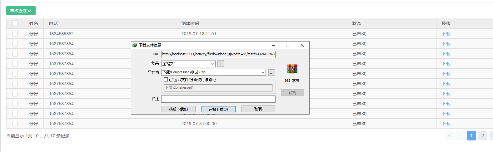
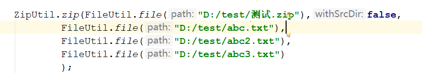

# 7.31

1.将多个文件进行打包操作

实战将符合条件的文件打包下载



 效果图：


这是一个叫 Hutool 的工具包

网址：[https://hutool.cn/docs/\#/](https://hutool.cn/docs/#/)

Hutool是一个Java工具包，也只是一个工具包，它帮助我们简化每一行代码，减少每一个方法，让Java语言也可以“甜甜的”。它最初是作者项目中“util”包的一个整理，后来慢慢积累并加入更多非业务相关功能，并广泛学习其它开源项目精髓，经过自己整理修改，最终形成丰富的开源工具集。

Hutool是Hu \+ tool的自造词，谐音“糊涂”，寓意，追求“万事都作糊涂观，无所谓失，无所谓得”的境界。

导入依赖

```
<dependency>
    <groupId>cn.hutool</groupId>
    <artifactId>hutool-all</artifactId>
    <version>4.6.1</version>
</dependency>
```

代码：



这只是hutool的功能之一
