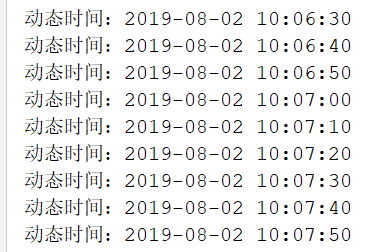

# 8.1

1. 使用Spring 内置定时器定时运行代码

①导入所需依赖

```
<!-- 开源作业调度框架 -->
<dependency>
  <groupId>org.quartz-scheduler</groupId>
  <artifactId>quartz</artifactId>
  <version>2.2.1</version>
</dependency>

<!-- spring依赖 -->
<!-- https://mvnrepository.com/artifact/org.springframework/spring-jdbc -->
<dependency>
  <groupId>org.springframework</groupId>
  <artifactId>spring-jdbc</artifactId>
  <version>5.1.5.RELEASE</version>
</dependency>

<!-- https://mvnrepository.com/artifact/org.springframework/spring-context-support -->
<dependency>
  <groupId>org.springframework</groupId>
  <artifactId>spring-context-support</artifactId>
  <version>5.1.5.RELEASE</version>
</dependency>

<!-- https://mvnrepository.com/artifact/org.springframework/spring-webmvc -->
<dependency>
  <groupId>org.springframework</groupId>
  <artifactId>spring-webmvc</artifactId>
  <version>5.1.5.RELEASE</version>
</dependency>
```

②配置web.xml文件

```
<!--Spring 的上下文联系-->
<context-param>
  <param-name>contextConfigLocation</param-name>
  <param-value>classpath*:springMVC-servlet.xml</param-value>
</context-param>

<!--Spring 容器启动器-->
<servlet>
  <servlet-name>springMVC</servlet-name>
  <servlet-class>org.springframework.web.servlet.DispatcherServlet</servlet-class>
  <init-param>
    <param-name>contextConfigLocation</param-name>
    <param-value>classpath:springMVC-servlet.xml</param-value>
  </init-param>
  <load-on-startup>0</load-on-startup>
</servlet>

<!--为DispatcherServlet 建树映射-->
<servlet-mapping>
  <servlet-name>springMVC</servlet-name>
  <url-pattern>/</url-pattern>
</servlet-mapping>
```

③创建springMVC\-servlet.xml文件，在里面配置定时器

```
<?xml version="1.0" encoding="UTF-8"?>
<beans xmlns="http://www.springframework.org/schema/beans"
       xmlns:xsi="http://www.w3.org/2001/XMLSchema-instance" xmlns:p="http://www.springframework.org/schema/p"
       xmlns:context="http://www.springframework.org/schema/context"
       xmlns:aop="http://www.springframework.org/schema/aop"
       xsi:schemaLocation="http://www.springframework.org/schema/beans
  http://www.springframework.org/schema/beans/spring-beans-3.0.xsd">
    <!--定时加载的目标类-->
    <bean id="job" class="test.FirstQuartz"></bean>
    <!--然后是配置 定时器详情，其中的value=“doit” 是FirstQuartz类中的方法-->
    <bean id="timeDitail" class="org.springframework.scheduling.quartz.MethodInvokingJobDetailFactoryBean">
        <property name="targetObject">
            <ref bean="job"/>
        </property>
        <property name="targetMethod">
            <value>doit</value>
        </property>
    </bean>
    <!--是定义时间间隔触发器-->
    <bean id="timeTigger"
          class="org.springframework.scheduling.quartz.CronTriggerFactoryBean">
        <property name="jobDetail">
            <ref bean="timeDitail"/>
        </property>
        <property name="cronExpression">
            <!--每10s执行一次-->
            <value>0/10 * * * * ?</value> //这里时间可以自己修改，具体怎么修改百度查
        </property>
    </bean>
    <!--启动定时器-->
    <bean class="org.springframework.scheduling.quartz.SchedulerFactoryBean">
        <property name="triggers">
            <list>
                <ref bean="timeTigger"/>
            </list>
        </property>
    </bean>
</beans>

注意：上面配置的id名字之间都是有联系的，其中配置时间间隔中value会具体在下面解释。
```

④写一个定时器的类，注意这个类要对应配置文件中获取的类

```
public class FirstQuartz {
    public static void doit(){
        System.out.println("动态时间："+new SimpleDateFormat("yyyy-MM-dd HH:mm:ss").format(new Date()));
    }
}
```

⑤效果图



下面来具体说一下那个时间的定义：（定时器的时间表达式）

```
字段 允许值 允许的特殊字符   
秒 0-59 , - * /   
分 0-59 , - * /   
小时 0-23 , - * /   
日期 1-31 , - * ? / L W C   
月份 1-12 或者 JAN-DEC , - * /   
星期 1-7 或者 SUN-SAT , - * ? / L C #   
年（可选） 留空, 1970-2099 , - * /   
表达式意义   
"0 0 12 * * ?" 每天中午12点触发   
"0 15 10 ? * *" 每天上午10:15触发   
"0 15 10 * * ?" 每天上午10:15触发   
"0 15 10 * * ? *" 每天上午10:15触发   
"0 15 10 * * ? 2005" 2005年的每天上午10:15触发   
"0 * 14 * * ?" 在每天下午2点到下午2:59期间的每1分钟触发   
"0 0/5 14 * * ?" 在每天下午2点到下午2:55期间的每5分钟触发   
"0 0/5 14,18 * * ?" 在每天下午2点到2:55期间和下午6点到6:55期间的每5分钟触发   
"0 0-5 14 * * ?" 在每天下午2点到下午2:05期间的每1分钟触发   
"0 10,44 14 ? 3 WED" 每年三月的星期三的下午2:10和2:44触发   
"0 15 10 ? * MON-FRI" 周一至周五的上午10:15触发   
"0 15 10 15 * ?" 每月15日上午10:15触发   
"0 15 10 L * ?" 每月最后一日的上午10:15触发   
"0 15 10 ? * 6L" 每月的最后一个星期五上午10:15触发   
"0 15 10 ? * 6L 2002-2005" 2002年至2005年的每月的最后一个星期五上午10:15触发   
"0 15 10 ? * 6#3" 每月的第三个星期五上午10:15触发   
每天早上6点   
0 6 * * *   
每两个小时   
0 */2 * * *   
晚上11点到早上8点之间每两个小时，早上八点   
0 23-7/2，8 * * *   
每个月的4号和每个礼拜的礼拜一到礼拜三的早上11点   
0 11 4 * 1-3   
1月1日早上4点   
0 4 1 1 *   
有些子表达式能包含一些范围或列表  
例如：子表达式（天（星期））可以为 “MON-FRI”，“MON，WED，FRI”，“MON-WED,SAT”  
“*”：字符代表所有可能的值  
因此，“*”在子表达式（月）里表示每个月的含义，“*”在子表达式（天（星期））表示星期的每一天  
“/”：字符用来指定数值的增量  
例如：在子表达式（分钟）里的“0/15”表示从第0分钟开始，每15分钟 ;
在子表达式（分钟）里的“3/20”表示从第3分钟开始，每20分钟（它和“3，23，43”）的含义一样  
“？”：字符仅被用于天（月）和天（星期）两个子表达式，表示不指定值  
当2个子表达式其中之一被指定了值以后，为了避免冲突，需要将另一个子表达式的值设为“？”  
“L”： 字符仅被用于天（月）和天（星期）两个子表达式，它是单词“last”的缩写  
但是它在两个子表达式里的含义是不同的。  
在天（月）子表达式中，“L”表示一个月的最后一天 ,
在天（星期）自表达式中，“L”表示一个星期的最后一天，也就是SAT  
如果在“L”前有具体的内容，它就具有其他的含义了  
例如：“6L”表示这个月的倒数第６天，“ＦＲＩＬ”表示这个月的最后一个星期五  
注意：在使用“L”参数时，不要指定列表或范围，因为这会导致问题
```
