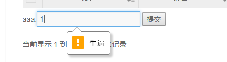

# 8.21

    

# HTML5\-\-表单新特性使用自定义错误提示消息validity属性

网址：[https://blog.csdn.net/baidu\_25343343/article/details/54990802](https://blog.csdn.net/baidu_25343343/article/details/54990802)

```
<form>
    aaa:<input id="nb" value="" type="text" required>
    <input type="submit" value="提交" onclick="test()">
</form>
```

```
<script>
    function test() {
        var nb=document.querySelector('#nb');
        var hm= $("#nb").val();
        if(hm == '1'){
            nb.setCustomValidity('牛逼')
        }
    }
</script>
```

效果图



判断 input 里的值是否改变

onchange 事件

onpropertychange 事件

第一个需要你离开文本框，点击别的地方

第二个不需要，不过你要谨慎使用

网址：[https://www.cnblogs.com/llguanli/p/7340708.html](https://www.cnblogs.com/llguanli/p/7340708.html)

控制 input标签里输入几位字符串

**maxlength 属性**
