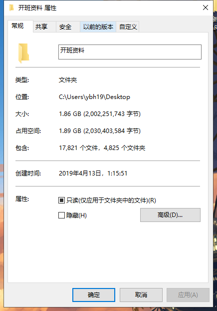
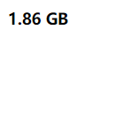
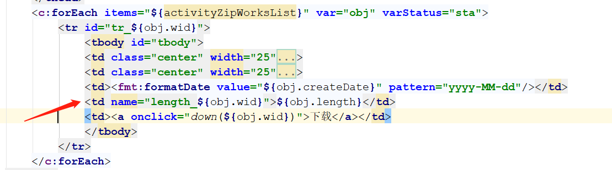
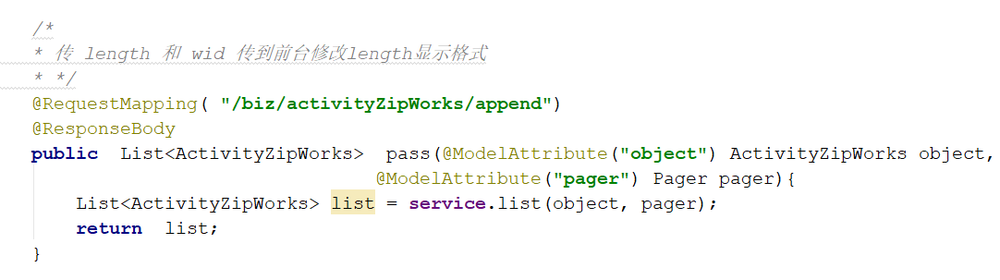
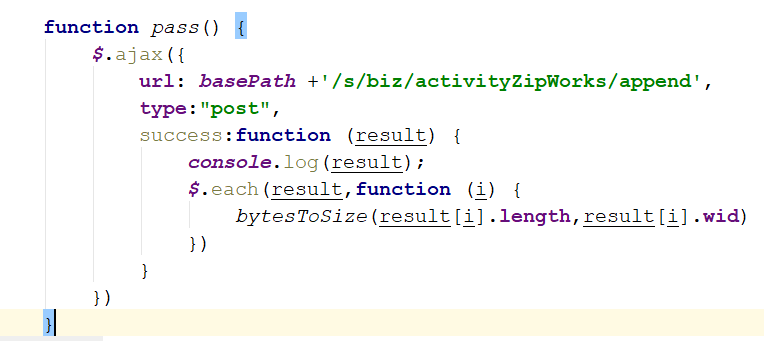
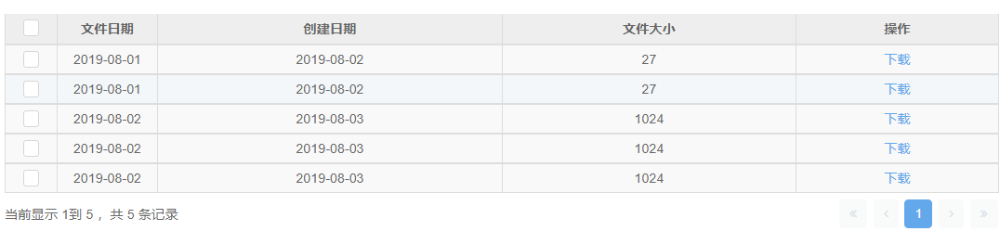
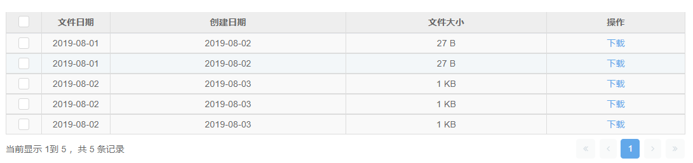

# 8.3

1. 一个简单的工具方法  因为获取文件大小的返回值是字节，所以找了一个自动转换文件大小的显示格式

```
function bytesToSize(bytes) {
       if (bytes === 0) return '0 B';
        var k = 1024;
        sizes = ['B','KB', 'MB', 'GB', 'TB', 'PB', 'EB', 'ZB', 'YB'];
        i = Math.floor(Math.log(bytes) / Math.log(k));
                                        //.toFixed(2) 是保留两位小数，不需要删掉就好了
        return (bytes / Math.pow(k, i)).toFixed(2) + ' ' + sizes[i];
}
```

效果图：



页面显示：



2.业务需求：页面的 table 里有一个文件大小的字段，但是获取的文件大小的值是字节，需要改变它显示的格式，所以需要给 table 下的多个 td修改文本内容



给这个 td 赋一个name的属性名，它的值为 length\_${ obj.wid } ，这样每一个td的属性值都不一样，但是又一一对应，这个时候我们需要两个条件才能完成这个需求，第一个就是 wid 第二个 就是 length （文件的大小），写一个ajax获取从后端传回来的值





ajax拿到值后通过遍历，这样获取到需要的每一个的 wid 跟 length，然后把每一个 wid 和 length（文件大小）传给上面写的工具方法 （自动转换文件大小的显示格式 ）修改每一个对应td 的文本内容。

需求实现前：



需求实现后：


