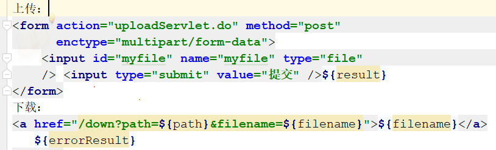

# 8.5

1. 使用 jsp\+servlet 实现简单的文件上传下载

上传servlet

```
package servlet;

import javax.servlet.RequestDispatcher;
import javax.servlet.ServletException;
import javax.servlet.http.HttpServlet;
import javax.servlet.http.HttpServletRequest;
import javax.servlet.http.HttpServletResponse;
import java.io.*;

//上传
public class UpServlet extends HttpServlet {
    @Override
    public void doGet(HttpServletRequest req, HttpServletResponse resp)
            throws ServletException, IOException {
        doPost(req,resp);
    }

    @Override
    public void doPost(HttpServletRequest req, HttpServletResponse resp)
            throws ServletException, IOException {
        //从request当中获取流信息
        InputStream fileSource = req.getInputStream();
        String tempFileName = "E:/tempFile";
        //tempFile指向临时文件
        File tempFile = new File(tempFileName);
        //outputStram文件输出流指向这个临时文件
        FileOutputStream outputStream = new FileOutputStream(tempFile);
        byte b[] = new byte[1024];
        int n;
        while(( n = fileSource.read(b)) != -1){
            outputStream.write(b, 0, n);
        }
        //关闭输出流、输入流
        outputStream.close();
        fileSource.close();

        //获取上传文件的名称
        RandomAccessFile randomFile = new RandomAccessFile(tempFile,"r");
//    l = new String(l.getBytes("8859_1"),"gbk");
        String str2 = randomFile.readLine();
        //编码转换
        str2 = new String(str2.getBytes("8859_1"),"utf-8");
        System.out.println(str2);
        String str = randomFile.readLine();
        str = new String(str.getBytes("8859_1"),"utf-8");
        System.out.println(str);
        int beginIndex = str.lastIndexOf("=") + 2;
        int endIndex = str.lastIndexOf("\"");
        String filename = str.substring(beginIndex, endIndex);
        System.out.println("文件名字：:" + filename);

        //重新定位文件指针到文件头
        randomFile.seek(0);
        long startPosition = 0;
        int i = 1;
        //获取文件内容 开始位置
        while(( n = randomFile.readByte()) != -1 && i <=4){
            if(n == '\n'){
                startPosition = randomFile.getFilePointer();
                i ++;
            }
        }
        startPosition = randomFile.getFilePointer() -1;
        //获取文件内容 结束位置
        randomFile.seek(randomFile.length());
        long endPosition = randomFile.getFilePointer();
        int j = 1;
        while(endPosition >=0 && j<=2){
            endPosition--;
            randomFile.seek(endPosition);
            if(randomFile.readByte() == '\n'){
                j++;
            }
        }
        endPosition = endPosition -1;

        //设置保存上传文件的路径
        //路径可以自行设置
        String realPath = "D:/zipWorks";
//    String realPath = getServletContext().getRealPath("/") + "images";
        File fileupload = new File(realPath);
        System.out.println("保存到："+realPath);
        if(!fileupload.exists()){
            fileupload.mkdir();
        }
        File saveFile = new File(realPath,filename);
        RandomAccessFile randomAccessFile = new RandomAccessFile(saveFile,"rw");
        //从临时文件当中读取文件内容（根据起止位置获取）
        randomFile.seek(startPosition);
        while(startPosition < endPosition){
            randomAccessFile.write(randomFile.readByte());
            startPosition = randomFile.getFilePointer();
        }
        //关闭输入输出流、删除临时文件
        randomAccessFile.close();
        randomFile.close();
        tempFile.delete();

        req.setAttribute("result", "上传成功！");
        req.setAttribute("path",realPath+"/"+filename);
        req.setAttribute("filename",filename);
        RequestDispatcher dispatcher = req.getRequestDispatcher("up.jsp");
        dispatcher.forward(req, resp);
    }
}
```

下载servlet

```
package servlet;

import javax.servlet.ServletException;
import javax.servlet.ServletOutputStream;
import javax.servlet.http.HttpServlet;
import javax.servlet.http.HttpServletRequest;
import javax.servlet.http.HttpServletResponse;
import java.io.File;
import java.io.FileInputStream;
import java.io.IOException;
import java.io.InputStream;

public class DownServlet extends HttpServlet {
    @Override
    public void doGet(HttpServletRequest req, HttpServletResponse resp)
            throws ServletException, IOException {
        //进行编码的转换，因为不能识别中文
        resp.setHeader("content-type","text/html;charset=UTF-8");
        String path = req.getParameter("path");
        String filename = req.getParameter("filename");
        path = new String(path.getBytes("8859_1"),"utf-8");
        System.out.println("开始准备下载:");
        System.out.println("路径：" + path );
        File file = new File(path);
        if (file.exists()) {
            //由于下载的时候与浏览器的编码不符，浏览器不能识别中文编码，这里要进行转换
            String value = new String(filename.getBytes("utf-8"),"ISO-8859-1");
            resp.setContentType("application/x-msdownload");
            resp.setHeader("Content-Disposition", "attachment;filename=\"" + value + "\"");
            InputStream inputStream = new FileInputStream(file);
            ServletOutputStream outputStream = resp.getOutputStream();
            byte b[] = new byte[1024];
            int n;
            while ((n = inputStream.read(b)) != -1) {
                outputStream.write(b, 0, n);
            }
            outputStream.close();
            inputStream.close();
        } else {
            //如果失败到哪个页面提示什么
            req.setAttribute("error", "文件不存在下载失败！！");
            resp.sendRedirect("error.jsp");
        }
    }
    @Override
    public void doPost(HttpServletRequest req, HttpServletResponse resp)
            throws ServletException, IOException {
        doGet(req, resp);
    }    
}
```

web.xml 里配置servlet

```
<!--配置servlet-->
<servlet>
  <servlet-name>upload</servlet-name>
  <servlet-class>servlet.UpServlet</servlet-class>
</servlet>
<servlet-mapping>
  <servlet-name>upload</servlet-name>
  <url-pattern>/uploadServlet.do</url-pattern>
</servlet-mapping>

<servlet>
  <servlet-name>down</servlet-name>
  <servlet-class>servlet.DownServlet</servlet-class>
</servlet>
<servlet-mapping>
  <servlet-name>down</servlet-name>
  <url-pattern>/down</url-pattern>
</servlet-mapping>
```

jsp页面


