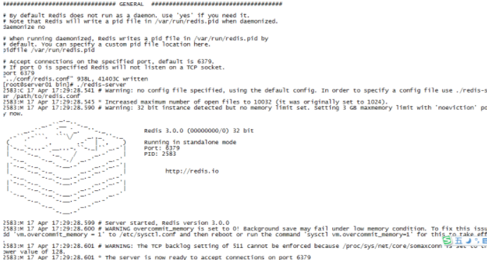

# Linux 上安装Reids基本�程

1�检查安装�赖程�

yum install gcc\-c\+\+

yum install \-y tcl

yum install wget

2���安装文件

wget [http://download.redis.io/releases/](http://download.redis.io/releases/)

这里�有很多版本，自己选择需�的下载

3�解�文件

   自己新建一个目录将redis解�到里�

tar \-zxvf redis\-3.2.01.tar.gz

mv redis\-3.2.01 /usr/local/redis

4�进入目录

cd /usr/local/redis

5�编译安装

make

make install

6�设置�置文件路径

mkdir \-p /etc/redis

cp redis.conf/etc/redis

7�修改�置文件

　redis.conf是redis的�置文件，redis.conf在redis��目录。

　注�修改port作为redis进程的端�,port默认6379。如�需��建redis集群，�万别忘了修改端��。

   redis有两��动方�，直��行bin/redis\-server将以�端模��动，�端模��动的缺点是ssh命令窗�关闭则redis\-server程�结�，���使用此方法。如下图：

   

 **  �端模��动**

   修改redis.conf�置文件， daemonize yes 以�端模��动。**���**

   打开redis.conf,使用命令 :/ daemonize 快速查找到daemonize然�修改。

vi /etc/redis/redis.conf

仅修改： daemonize yes （no\-\-\>yes）

8��动

/usr/local/bin/redis\-server /etc/redis/redis.conf

9�查看�动

ps \-ef | grep redis

10�使用客户端

redis\-cli

\>set name david

OK

\>get name

"david"

11.关闭客户端

redis\-cli shutdown

12�开机�动�置

echo "/usr/local/bin/redis\-server /etc/redis/redis.conf &" \>\> /etc/rc.local

开机�动��置在 rc.local 中，而 /etc/profile 文件，�有用户登录了，�会被执行。

13�设置密�

因为这是给局域网内的很多人使用，所以设置一个访问密�很有必�。

修改redis.conf文件�置 

使用命令 :/ requirepass 快速查找到 \# requirepass foobared 然���注释，这个foobared改为自己的密�。然�wq�存。

14���redis

 sudo service redis restart  这个时候�试登录redis，���以登上，但是执行具体命令是�示�作��许

1. redis\-cli \-h 127.0.0.1 \-p 6379  
2. redis 127.0.0.1:6379\>  
3. redis 127.0.0.1:6379\> keys \*  
4. **\(error\) ERR operation not permitted Â** 

�试用密�登录并执行具体的命令看到�以�功执行

1. redis\-cli \-h 127.0.0.1 \-p 6379 \-a password
2. redis 127.0.0.1:6379\> keys \*
3. 1\) "myset"  
4. 2\) "mysortset"  
5. redis 127.0.0.1:6379\> select 1  
6. OK  

如�是自己在本机上使用�在已��以了，因为我这是局域网内�供给大家使用的所以还需�最�的�置。

当时修改开�的�置文件�，�动项目报错。

org.springframework.data.redis.RedisConnectionFailureException: Cannot get Jedis connection; nested exception is redis.clients.jedis.exceptions.JedisConnectionException: **Could not get a resource from the pool**

    at org.springframework.data.redis.connection.jedis.JedisConnectionFactory.fetchJedisConnector\(JedisConnectionFactory.java:162\) ~\[spring\-data\-redis\-1.5.0.RELEASE.jar:1.5.0.RELEASE\]

    at org.springframework.data.redis.connection.jedis.JedisConnectionFactory.getConnection\(JedisConnectionFactory.java:251\) ~\[spring\-data\-redis\-1.5.0.RELEASE.jar:1.5.0.RELEASE\]

    at org.springframework.data.redis.connection.jedis.JedisConnectionFactory.getConnection\(JedisConnectionFactory.java:58\) ~\[spring\-data\-redis\-1.5.0.RELEASE.jar:1.5.0.RELEASE\]

    at org.springframework.data.redis.core.RedisConnectionUtils.doGetConnection\(RedisConnectionUtils.java:128\) ~\[spring\-data\-redis\-1.5.0.RELEASE.jar:1.5.0.RELEASE\]

 打开cmd 然�使用 telnet ip 端� �ping �置的redis（���redis已�动），��无法ping通。

这是因为在redis.conf中有个�置 bind 127.0.0.1 这个是默认�有本机访问，把这个注释�就好了，注释以�查看redis进程就�为下�这样：

\[root@localhost redis\]\# ps \-ef | grep redis

root      5655     1  0 11:40 ?        00:00:23 **./redis\-server \*:6379**

root     21184 18040  0 17:33 pts/1    00:00:00 grep \-\-color=auto redis

这个**\***�就表示�许其它用户访问了。然�在用打开本机的 cmd使用 telnet ip 端� 就能ping通了。

 

以上是全部内容，�足之处欢�指出，互相交��有进步�
