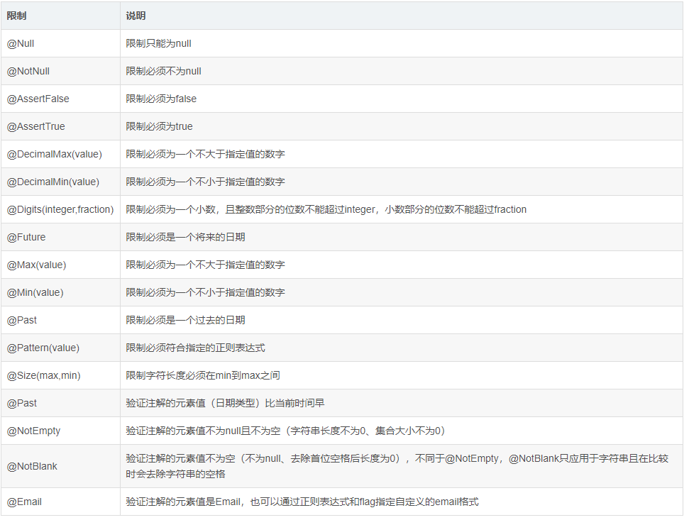

# SpringBoot @Valid 注解

## **@Valid**

用于验证注解是否符合要求，直接加在变量user之前，在变量中添加验证信息的要求，当不符合要求时就会在方法中返回message 的错误提示信息。

```
@RestController
@RequestMapping("/user")
public class UserController {
    @PostMapping
    public User create (@Valid @RequestBody User user) {
        System.out.println(user.getId());
        System.out.println(user.getUsername());
        System.out.println(user.getPassword());
        user.setId("1");
        return user;
    }
}

```

然后在 User 类中添加验证信息的要求

```

public class User {

private String id;

@NotBlank(message = "密码不能为空")

private String password;

}

```

@NotBlank 注解所指的 password 字段，表示验证密码不能为空，如果为空的话，上面 Controller 中的 create 方法会将message 中的"密码不能为空"返回。

当然也可以添加其他验证信息的要求：



除此之外还可以自定义验证信息的要求，例如下面的 @MyConstraint：

```

public class User {

private String id;

@MyConstraint(message = "这是一个测试")

private String username;

}

```

注解的具体内容：

```

@Constraint(validatedBy = {MyConstraintValidator.class})
@Target({ELementtype.METHOD, ElementType.FIELD})
@Retention(RetentionPolicy.RUNTIME)
public @interface MyConstraint {
    String message();
    Class<?>[] groups() default {};
    Class<? extends Payload>[] payload() default {};
}
```

下面是校验器：

```

public class MyConstraintValidator implements ConstraintValidator<MyConstraint, Object> {
    @Autowired
    private UserService userService;
    
    @Override
    public void initialie(@MyConstraint constarintAnnotation) {
        System.out.println("my validator init");
    }
    
    @Override
    public boolean isValid(Object value, ConstraintValidatorContext context) {
        userService.getUserByUsername("seina");
        System.out.println("valid");
        return false;
    }
}
```
