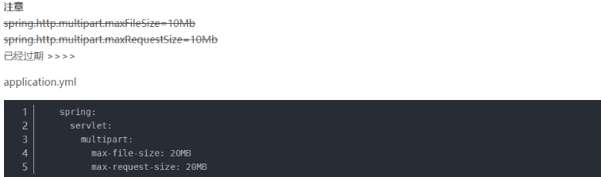

# SpringBoot 上传下载

controller

```
ackage com.ybh.controller;

import org.springframework.boot.web.servlet.MultipartConfigFactory;
import org.springframework.context.annotation.Bean;
import org.springframework.stereotype.Controller;
import org.springframework.util.unit.DataSize;
import org.springframework.util.unit.DataUnit;
import org.springframework.web.bind.annotation.*;
import org.springframework.web.multipart.MultipartFile;
import org.springframework.web.multipart.MultipartHttpServletRequest;

import javax.servlet.MultipartConfigElement;
import javax.servlet.http.HttpServletRequest;
import javax.servlet.http.HttpServletResponse;
import java.io.*;
import java.util.List;
import java.util.Map;

@Controller
public class FileController {

  /*
   * 获取file.html页面
   */
  @RequestMapping("file")
  public String file(){
      return "/file";
  }

  /**
   * 实现文件上传
   * */
  @RequestMapping("fileUpload")
  @ResponseBody
  public Map<String,Object> fileUpload(@RequestParam("fileName") MultipartFile file){
      Map<String,Object> map=null;
      Boolean flag=true;
      File dest =null;
      if(file.isEmpty()){
          flag= false;
      }
      String fileName = file.getOriginalFilename();
      int size = (int) file.getSize();
      System.out.println(fileName + "-->" + size);

      String path = "F:/test" ;
       dest = new File(path + "/" + fileName);
      if(!dest.getParentFile().exists()){ //判断文件父目录是否存在
          dest.getParentFile().mkdir();
      }
      try {
          file.transferTo(dest); //保存文件
          flag= true;
      } catch (IllegalStateException e) {
          // TODO Auto-generated catch block
          e.printStackTrace();
          flag= false;
      } catch (IOException e) {
          // TODO Auto-generated catch block
          e.printStackTrace();
          flag= false;
      }
      map.put("flag",flag);
      map.put("path",dest.getPath());
      return map;
  }

  /*
   * 获取multifile.html页面
   */
  @RequestMapping("multifile")
  public String multifile(){
      return "/multifile";
  }

  /**
   * 实现多文件上传
   * */
  @RequestMapping(value="multifileUpload",method= RequestMethod.POST)
  public @ResponseBody Map<String,Object> multifileUpload(HttpServletRequest request){

      List<MultipartFile> files = ((MultipartHttpServletRequest)request).getFiles("fileName");
      Map<String,Object> map=null;
      Boolean flag=true;
      File dest =null;
      if(files.isEmpty()){
          flag=false;
      }

      String path = "F:/test" ;

      for(MultipartFile file:files){
          String fileName = file.getOriginalFilename();
          int size = (int) file.getSize();
          System.out.println(fileName + "-->" + size);

          if(file.isEmpty()){
              flag=false;
          }else{
               dest = new File(path + "/" + fileName);
              if(!dest.getParentFile().exists()){ //判断文件父目录是否存在
                  dest.getParentFile().mkdir();
              }
              try {
                  file.transferTo(dest);
              }catch (Exception e) {
                  // TODO Auto-generated catch block
                  e.printStackTrace();
                  flag=false;
              }
          }
      }
      map.put("flag",flag);
      map.put("path",dest.getPath());
      return map;
  }

  @RequestMapping("/download")
  public String downLoad(HttpServletResponse response) throws UnsupportedEncodingException {
      // 文件地址，真实环境是存放在数据库中的
      String filename="hdwfm.sql";
      String filePath = "F:/test" ;
      File file = new File(filePath + "/" + filename);
      if(file.exists()){ //判断文件父目录是否存在
          response.setContentType("application/vnd.ms-excel;charset=UTF-8");
          response.setCharacterEncoding("UTF-8");
          // response.setContentType("application/force-download");
          response.setHeader("Content-Disposition", "attachment;fileName=" +   java.net.URLEncoder.encode(filename,"UTF-8"));
          byte[] buffer = new byte[1024];
          FileInputStream fis = null; //文件输入流
          BufferedInputStream bis = null;

          OutputStream os = null; //输出流
          try {
              os = response.getOutputStream();
              fis = new FileInputStream(file);
              bis = new BufferedInputStream(fis);
              int i = bis.read(buffer);
              while(i != -1){
                  os.write(buffer);
                  i = bis.read(buffer);
              }

          } catch (Exception e) {
              // TODO Auto-generated catch block
              e.printStackTrace();
          }
          System.out.println("----------file download---" + filename);
          try {
              bis.close();
              fis.close();
          } catch (IOException e) {
              // TODO Auto-generated catch block
              e.printStackTrace();
          }
      }
      return null;
  }

}
```

前端页面

```
<html xmlns="http://www.w3.org/1999/xhtml" xmlns:th="http://www.thymeleaf.org" xmlns:sec="http://www.thymeleaf.org/thymeleaf-extras-springsecurity3"><head>
<meta charset="UTF-8" />
<title>Insert title here</title></head><body><h1 th:inlines="text">文件上传</h1><form action="fileUpload" method="post" enctype="multipart/form-data">
<p>选择文件: <input type="file" name="fileName"/></p>
<p><input type="submit" value="提交"/></p></form></body></html>

multifile.html
<!DOCTYPE html><html xmlns="http://www.w3.org/1999/xhtml" xmlns:th="http://www.thymeleaf.org"
   xmlns:sec="http://www.thymeleaf.org/thymeleaf-extras-springsecurity3"><head>
<meta charset="UTF-8" />
<title>Insert title here</title></head><body><h1 th:inlines="text">文件上传</h1><form action="multifileUpload" method="post" enctype="multipart/form-data" >
<p>选择文件1: <input type="file" name="fileName"/></p>
<p>选择文件2: <input type="file" name="fileName"/></p>
<p>选择文件3: <input type="file" name="fileName"/></p>
<p><input type="submit" value="提交"/></p></form></body></html>
```

SpringBoot的默认上传文件的大小是2m 如果你上传的文件超过了2m就会出现错误。

这个时候我们可以再application.yml里面进行修改



第二种方法是直接在springboot的启动类里加入下面的代码。

```
/**
  * 文件上传配置
  * @return
  */
@Bean
public MultipartConfigElement multipartConfigElement() {
        MultipartConfigFactory factory = new MultipartConfigFactory();
        //factory.setMaxFileSize(1024);
        //单个文件最大
        factory.setMaxFileSize(DataSize.of(60, DataUnit.MEGABYTES)); //KB,MB
        /// 设置总上传数据总大小
        factory.setMaxRequestSize(DataSize.of(60, DataUnit.MEGABYTES));
        return factory.createMultipartConfig();

} 
```

上传下载工具类

%\!\(EXTRA markdown.ResourceType=, string=, string=\)
