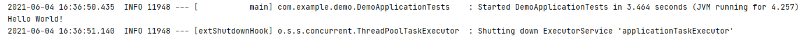

# SpringBoot 使用 RedisTemplate 连接操作Redis

1.所需依赖

```
<dependency>
    <groupId>org.springframework.boot</groupId>
    <artifactId>spring-boot-starter-data-redis</artifactId>
</dependency>
```

2.基本配置信息

```
spring:
    redis:
      host: 127.0.0.1
      port: 6379
      password: 123456
      jedis:
        pool:
          max-active: 8
          max-wait: -1
          max-idle: 500
          min-idle: 0
      lettuce:
        shutdown-timeout: 0

```

3.序列化器

这里先说一下Spring提供了那些序列化器（各自作用自行百度，这里不再赘述）

Jackson2JsonRedisSerializer

JdkSerializationRedisSerializer

OxmSerializer

StringRedisSerializer

GenericToStringRedisSerializer

GenericJackson2JsonRedisSerializer

然后以下是一些问题需要搞清楚

为什么需要序列化？

你要记住一句话，在JAVA中，一切皆对象，而将对象的状态信息转为存储或传输的形式需要序列化。

序列号实体类

```
/**
* @author ybh
* @version 1.0
* @date 2021/6/4 16:04
*/
@Configuration
@EnableCaching
public class RedisConfig extends CachingConfigurerSupport {

    /**
     * spring boot redis默认序列化方式
     *
     * @return RedisTemplate
     */
    @Bean
    public RedisTemplate<String, Object> getRedisTemplate(RedisConnectionFactory redisConnectionFactory) {
        final RedisTemplate<String, Object> redisTemplate = new RedisTemplate<>();
        redisTemplate.setConnectionFactory(redisConnectionFactory);
        redisTemplate.setKeySerializer(RedisSerializer.string());
        redisTemplate.setHashKeySerializer(RedisSerializer.string());
        redisTemplate.setValueSerializer(new JdkSerializationRedisSerializer());
        redisTemplate.afterPropertiesSet();
        return redisTemplate;
    }
}
```

4.使用

```
@Resource
private RedisTemplate<String,Object> redisTemplate;

@Test
void redisTest(){
    redisTemplate.opsForValue().set("hello","Hello World!");
    System.out.println(redisTemplate.opsForValue().get("hello"));
}
```


