# Spring Boot之 Controller �收�数和返�数�总结(包括上传�下载文件)

**一��收�数（postman��）**

**1.form表�**

@RequestParam\("name"\) String name

会把传递过�的Form表�中的name对应到formData方法的name�数上

该注解�能�收json传�

该注解表示name字段是必须入�的，�则会报错

@RequestParam\(value = "name", required = false\) String name

required = false表示必须入�

@RequestParam\(value = "name", defaultValue = "admin"\) String name

defaultValue = "admin"表示当name入�为空的时候给它一个默认值admin

/\*\*

\* 测试�收form表��URL的数�。�能�收Json数�

\* \*/

@RequestMapping\(value = "/test1", method = RequestMethod.POST\)

public String formData\(@RequestParam\("name"\) String name , @RequestParam\("age"\) int age\){

String result = "receive name = "\+name\+" age = "\+age;

System.out.println\(result\);

return result;

}

**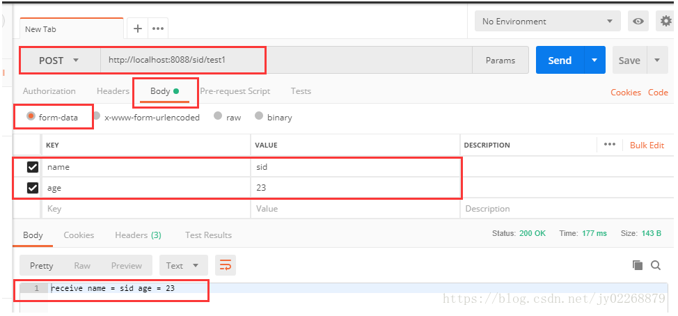**

### **2.URL**

代�跟1.form表�中的代�一样

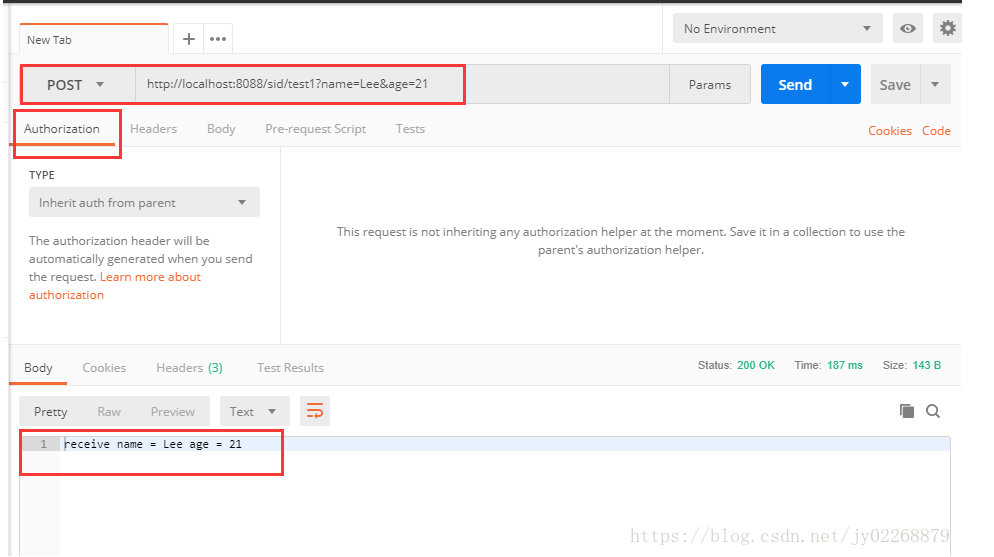

3.动��收URL中的数�

@PathVariable将URL中的��符�数绑定到�制器处�方法的入�

此�情况下，url求情中一定�带��符pageNo,pageSize的值，�然访问失败

�访问时一定�用 [http://localhost:8088/sid/test2/2/20](http://localhost:8088/sid/test2/2/20)

如�用 [http://localhost:8088/sid/test2](http://localhost:8088/sid/test2) 则访问失败

/\*\*

\* 测试动��收URL中的数�

\* \*/

@RequestMapping\(value = "/test2/{pageNo}/{pageSize}", method = RequestMethod.POST\)

public String urlData\(@PathVariable int pageNo , @PathVariable int pageSize\){

String result = "receive pageNo = "\+pageNo\+" pageSize = "\+pageSize;

System.out.println\(result\);

return result;

}

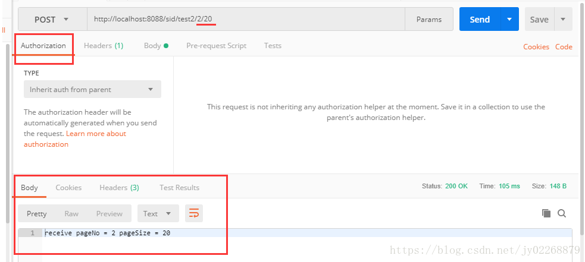

 

### **4.json**

**@RequestBody �收Json格�的数�需�加这个注解。该注解�能�收URL�Form表�传�**

/\*\*

\* 测试�收json数�

\* \*/

@RequestMapping\(value = "/jsonData", method = RequestMethod.POST\)

public String jsonData\(@RequestBody TestModel tm\){

String result = "receive name = "\+tm.getName\(\)\+" age = "\+tm.getAge\(\);

System.out.println\(result\);

return result;

}

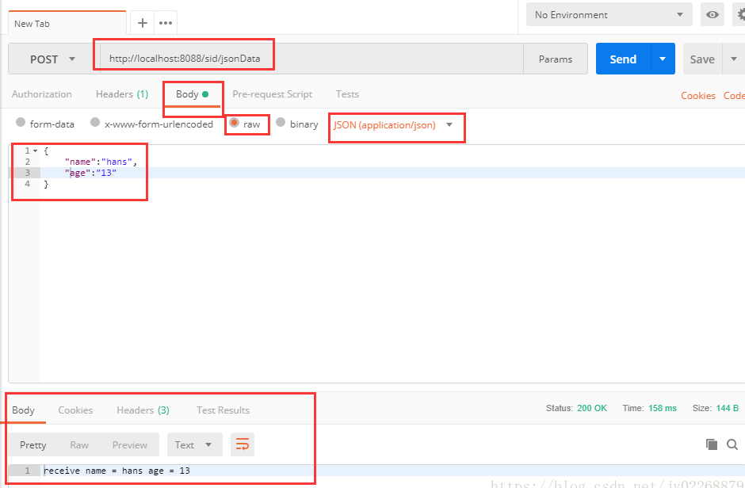

### **5.****@RequestMapping注解详细介�**

**1.处�多个URL**

@RestController

@RequestMapping\("/home"\)

public class IndexController {

@RequestMapping\(value = {

"",

"/page",

"page\*",

"view/\*,\*\*/msg"

}\)

String indexMultipleMapping\(\) {

return "Hello from index multiple mapping.";

}

}

这些 URL 都会由 indexMultipleMapping\(\) �处�： 

localhost:8080/home

localhost:8080/home/

localhost:8080/home/page

localhost:8080/home/pageabc

localhost:8080/home/view/

localhost:8080/home/view/view

 

2.HTTP的��方法

如POST方法

@RequestMapping\(value = "/test1", method = RequestMethod.POST\)

3.produces�consumes 

produces 指定返�的内容类�，仅当request请求头header中的\(Accept\)类�中包�该指定类��返�。结�@ResponseBody使用

\-\-\-\-\-\-\-\-\-\-\-\-\-\-\-\-\-\-\-\-\-

@Controller

@RequestMapping\(value = "/t"\)

public class TestController {

//方法仅处�request请求中Accept头中包�了"text/html"的请求 @ResponseBody

@RequestMapping\(value = "/produces",produces = {"text/html"}\)

public String testProduces\(String name\)

{

return "test requestMapping produces attribute\! "\+name;

}

}

方法仅处�request请求中Accept头中包�了"text/html"的请求

比如用postman�建一个Accept=“application/json�的请求，请求会失败

 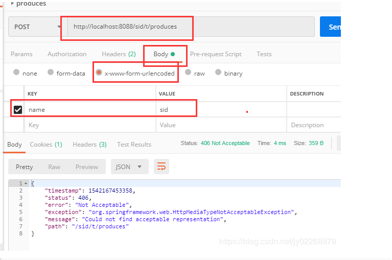

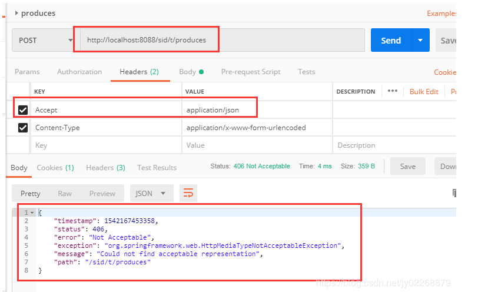

**comsumes Â** æŒ‡å®šå¤„ç�†è¯·æ±‚çš„æ��交内容类å�‹ï¼ˆContent\-Type），例如application/json, text/html。结å�ˆ@RequestBody使用

@Controller

@RequestMapping\(value = "/t"\)

public class TestController {

//方法仅处�request Content\-Type为"application/json"类�的请求 @ResponseBody

@RequestMapping\(value = "/consumes",consumes = {"application/json"}\)

public String testConsumes\(@RequestBody String name\)

{

return "test requestMapping consumes attribute\! "\+name;

}

}

方法仅处�request Content\-Type为"application/json"类�的请求。

如�用postman�建一个Content\-Type=“application/x\-www\-form\-urlencoded�的请求，该方法�处�

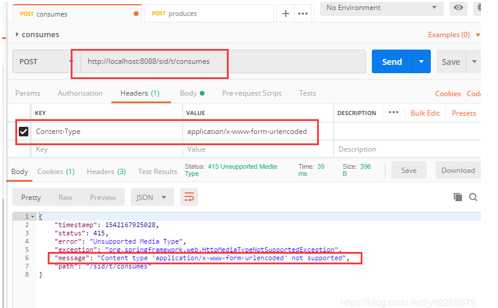

 

**4.headersÂ** 

根�请求中的消�头内容缩�请求映射的范围

例如：

�处�header中testHeader = sid的请求

//方法仅处�header中testHeader = sid的请求 @ResponseBody

@RequestMapping\(value = "/header",headers = {"testHeader = sid"}\)

public String testHeader\(String name\)

{

return "test requestMapping headers attribute\! "\+name;

}

�建一个header钟�带testHeader=sid的请求，会失败

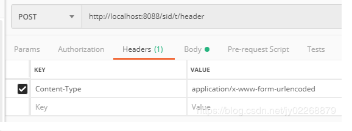

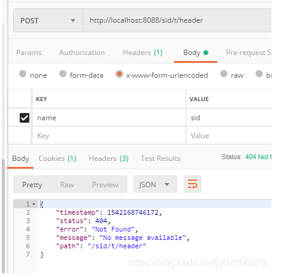

必须�header中带testHeader=sid的请求的请求�处�

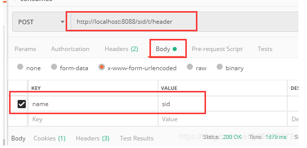

 

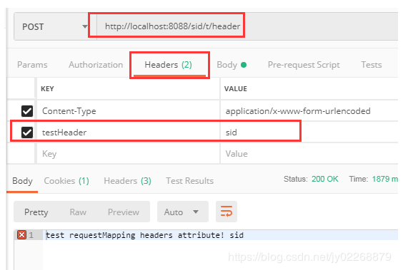

 

 

**5.结�params�性处�请求�数**

例如：

请求�数name=sid的时候由getParams方法处�

请求�数name=lee的时候由getParamsDifferent方法处�

@Controller

@RequestMapping\(value = "/t"\)

public class TestController {

@RequestMapping\(value = "/params", params = {

"name=sid"

}\)

@ResponseBody

public String getParams\(@RequestParam\("name"\) String name\) {

return "getParams method do " \+ name;

}

@RequestMapping\(value = "/params", params = {

"name=lee"

}\)

@ResponseBody

public String getParamsDifferent\(@RequestParam\("name"\) String name\) {

return "getParamsDifferent method do " \+ name;

}

}

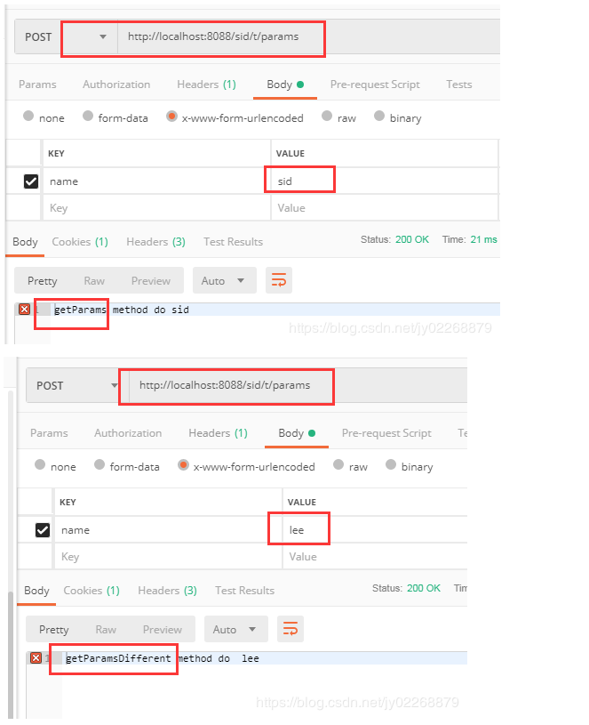

 

 

二�返�值

@RestController注解，相当�@Controller\+@ResponseBody两个注解的结�，返�json数��需�在方法��加@ResponseBody注解了，但使用@RestController这个注解，就�能返�jsp,html页�，视图解�器无法解�jsp,html页�

1.返���html页�

application.yml

\-\-\-\-\-\-\-\-\-\-\-\-\-\-\-\-\-\-\-\-\-

server:

port: 8088

servlet:

context\-path: /sid

spring:

mvc:

view:

prefix: /

suffix: .html

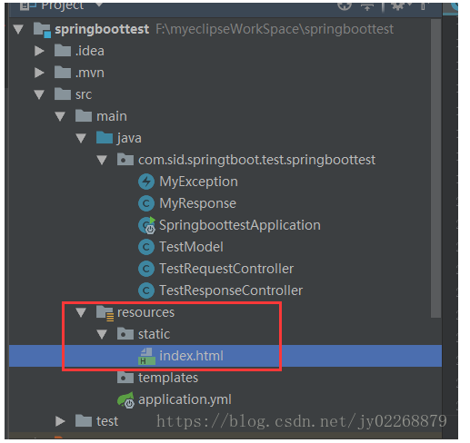

/\*\*

\* 返�界� index.html

\* @Controller修饰的类 直�定义方法返�值为String

\* \*/

@RequestMapping\(value = "/index"\)

public String index\(\){

return "index";

}

/\*\*返�界� index.html

\* @RestController修饰的类

\* 需���视图解�器

\* \*/

@RequestMapping\("/indexmv"\)

public ModelAndView indexmv\(\) {

ModelAndView mv = new ModelAndView\("index"\);

return mv;

}

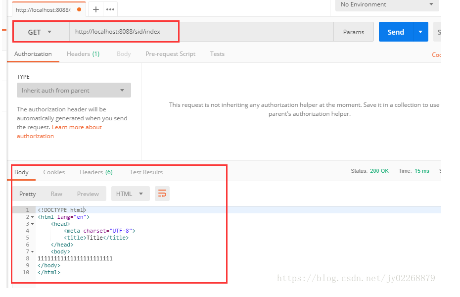

 

### **2.通过object返�查询结�**

@ResponseBody会把返�值��json

/\*\*

\* 直�查询得到的model类，@ResponseBody会把返�值��json

\* \*/

@RequestMapping\(value = "/object", method = RequestMethod.POST\)

@ResponseBody

public Object object\(@RequestParam\("name"\) String name , @RequestParam\("age"\) String age\){

TestModel t =getModel\( name , age\);

List\<TestModel\> list =new ArrayList\(\);

list.add\(t\);

return list;

}

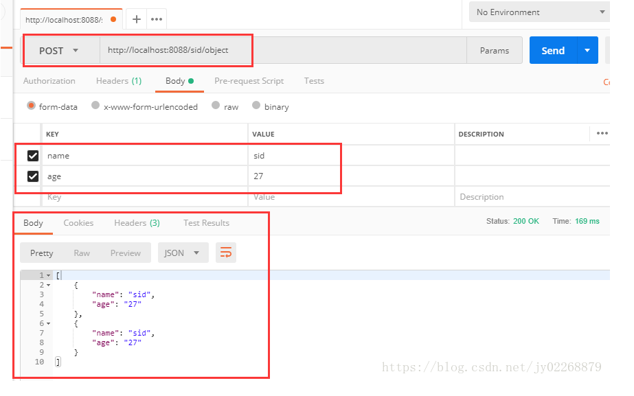

 

### **3.返�时直�抛出自定义异常**

/\*\*

\* 返�时直�抛出自定义异常

\* \*/

@RequestMapping\(value = "/list", method = RequestMethod.POST\)

@ResponseBody

public List\<TestModel\> list\(@RequestParam\("name"\) String name , @RequestParam\("age"\) String age\){

TestModel t =getModel\( name , age\);

if\(t \!= null\){

throw new MyException\("测试抛出自定义异常"\);

}

List\<TestModel\> list =new ArrayList\(\);

list.add\(t\);

list.add\(t\);

return list;

}

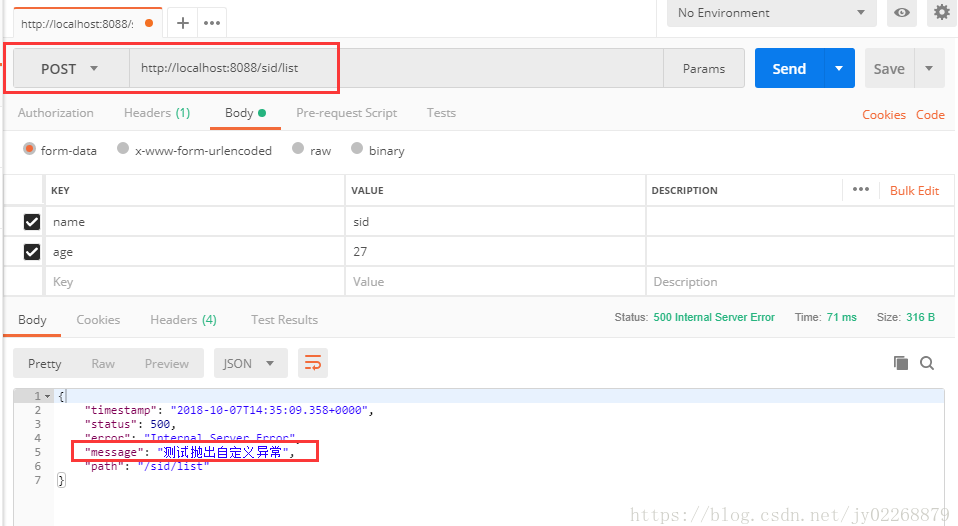

 

### **4.返�ResponseEntity**

两���的创建ResponseEntity的方�

/\*\*

\* 返�ResponseEntity

\*

\* ResponseEntity的优先级高�@ResponseBody。

\* 在�是ResponseEntity的情况下��检查有没有@ResponseBody注解。

\* 如��应类�是ResponseEntity�以�写@ResponseBody注解

\* \*/

@RequestMapping\(value = "/responseEntity", method = RequestMethod.POST\)

public ResponseEntity\<?\> responseEntity\(@RequestParam\("name"\) String name , @RequestParam\("age"\) String age\){

try{

TestModel t =getModel\( name , age\);

if\(\!t.getAge\(\).equals\("27"\)\){

throw new MyException\("年龄错误�"\);

}

List\<TestModel\> list =new ArrayList\(\);

list.add\(t\);

list.add\(t\);

HttpHeaders headers = new HttpHeaders\(\);

//headers.set\("Content\-type", "application/json;charset=UTF\-8"\);

headers.add\("code", "1"\);

headers.add\("msg", "success"\);

headers.add\("error", ""\);

return new ResponseEntity\<List\>\(list,headers,HttpStatus.OK\);

}catch \(MyException e\){

return ResponseEntity.badRequest\(\)

//.header\("Content\-type", "application/json;charset=UTF\-8"\)

.header\("code", "0"\)

.header\("msg", ""\)

.header\("error", e.getMessage\(\)\)//中文乱�

.build\(\);//build无返�值 body有返�值 }

}

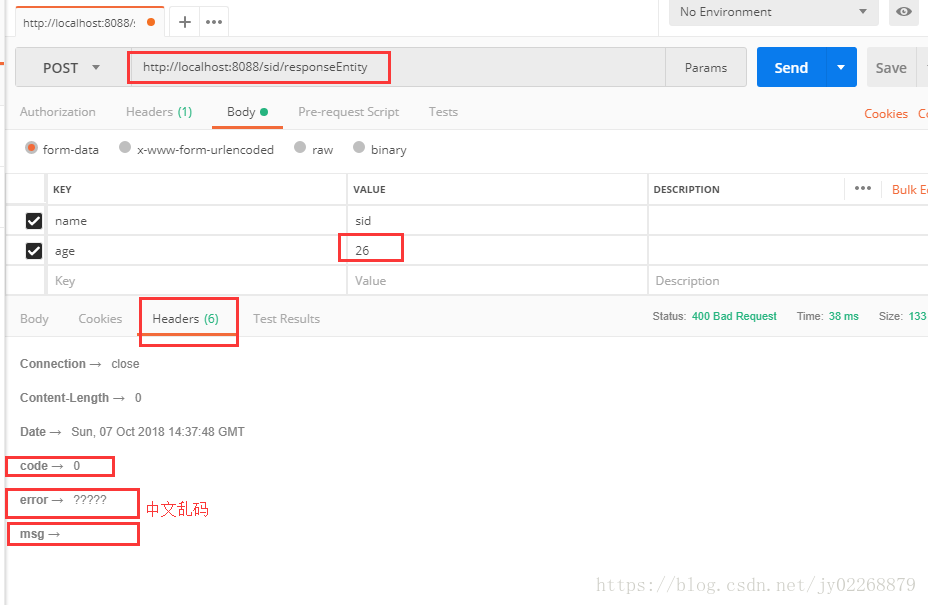

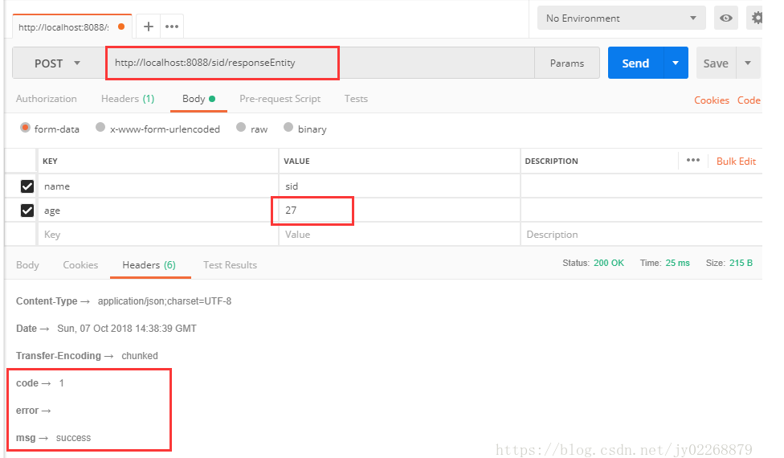

\-\-\-\-\-\-\-\-\-\-\-\-\-\-\-\-\-\-\-\-\-\-\-\-\-\-\-\-\-\-\-\-\-\-\-\-\-\-

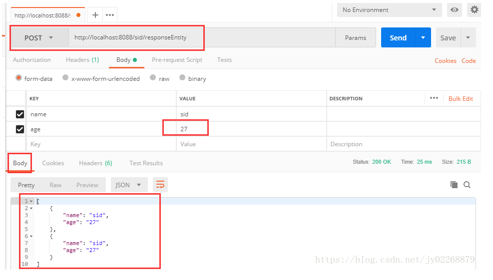

 

 

### **5.返�自定义类，其中有code msg error data 而查询结�在data中**

MyResponse.java

package com.sid.springtboot.test.springboottest;

public class MyResponse\<T\> {

private String code;

private String msg;

private String error;

private T data;

public MyResponse\(String code, String msg, String error, T data\) {

this.code = code;

this.msg = msg;

this.error = error;

this.data = data;

}

public String getCode\(\) {

return code;

}

public void setCode\(String code\) {

this.code = code;

}

public String getMsg\(\) {

return msg;

}

public void setMsg\(String msg\) {

this.msg = msg;

}

public String getError\(\) {

return error;

}

public void setError\(String error\) {

this.error = error;

}

public T getData\(\) {

return data;

}

public void setData\(T data\) {

this.data = data;

}

}

MyException.java

package com.sid.springtboot.test.springboottest;

public class MyException extends RuntimeException{

private String errorCode;

private String msg;

public MyException\(String message\) {

super\(message\);

}

public MyException\(String errorCode, String msg\) {

this.errorCode = errorCode;

this.msg = msg;

}

public String getErrorCode\(\) {

return errorCode;

}

public void setErrorCode\(String errorCode\) {

this.errorCode = errorCode;

}

public String getMsg\(\) {

return msg;

}

public void setMsg\(String msg\) {

this.msg = msg;

}

}

controller

/\*\*

\* 返�自定义类，其中有code msg error data 而查询结�在data中

\* \*/

@RequestMapping\(value = "/myResponse", method = RequestMethod.POST\)

@ResponseBody

public MyResponse\<?\> myResponse\(@RequestParam\("name"\) String name , @RequestParam\("age"\) String age\){

try{

TestModel t1 =getModel\( name , age\);

if\(\!t1.getAge\(\).equals\("27"\)\){

throw new MyException\("年龄错误�"\);

}

List\<TestModel\> list =new ArrayList\(\);

list.add\(t1\);

list.add\(t1\);

list.add\(t1\);

return new MyResponse\<List\>\("1","success",null,list\);

}catch \(MyException e\){

return new MyResponse\<\>\("0",null,e.getMessage\(\),null\);

}

}

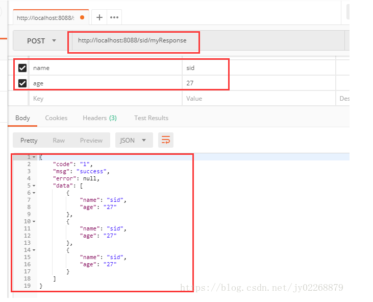

 

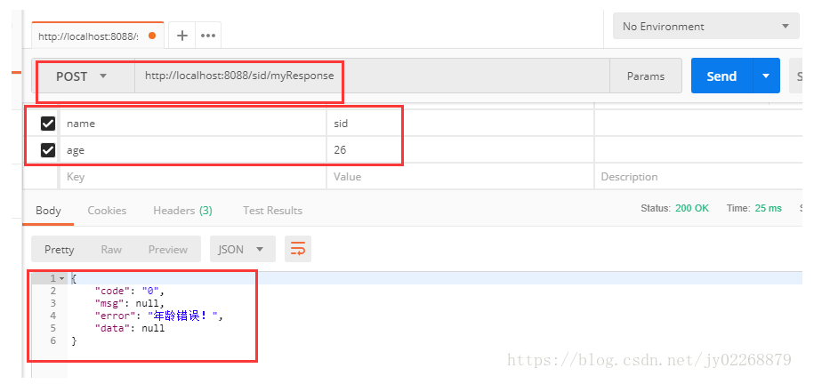

 

 

## **三�上传�下载文件**

### **上传文件**

@PostMapping\("/upload"\)

@ResponseBody

public Map\<String, String\> upload1\(@RequestParam\("file"\) MultipartFile file\) throws IOException {

System.out.println\("\[文件类�\] \- \[{}\]"\+ file.getContentType\(\)\);

System.out.println\("\[文件�称\] \- \[{}\]"\+ file.getOriginalFilename\(\)\);

System.out.println\("\[文件大�\] \- \[{}\]"\+ file.getSize\(\)\);

//�存

file.transferTo\(new File\("D:\\\\gitrep\\\\springboot\\\\testFile\\\\" \+ file.getOriginalFilename\(\)\)\);

Map\<String, String\> result = new HashMap\<\>\(16\);

result.put\("contentType", file.getContentType\(\)\);

result.put\("fileName", file.getOriginalFilename\(\)\);

result.put\("fileSize", file.getSize\(\) \+ ""\);

return result;

}

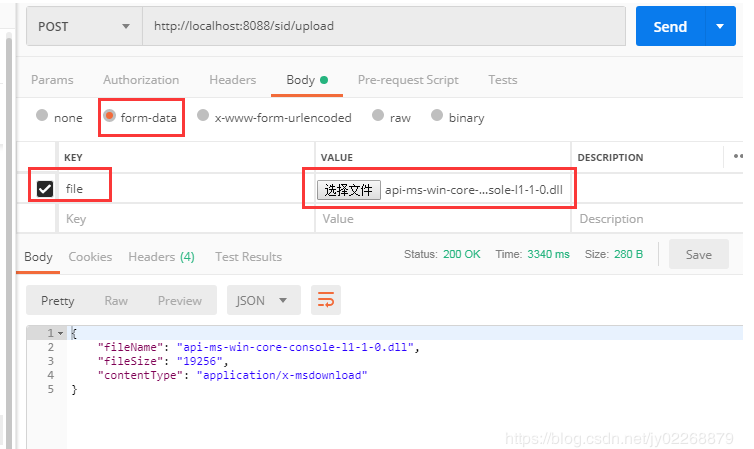

### **下载文件**

1.通过ResponseEntity\<InputStreamResource\>��

�装ResponseEntity，将文件�写入body中。这里注�一点，就是文件的格�需�根�具体文件的类��设置，一般默认为application/octet\-stream。文件头中设置缓存，以�文件的�字。文件的�字写入了，都�以��出�文件�机产生�字，而�能识别的问题。

\-\-\-\-\-\-\-\-\-\-\-\-\-\-\-\-\-\-\-\-\-

@GetMapping\("/download"\)

public ResponseEntity\<InputStreamResource\> downloadFile\(\) throws IOException {

String filePath = "D:\\\\gitrep\\\\springboot\\\\testFile\\\\" \+ "api\-ms\-win\-core\-console\-l1\-1\-0.dll";

FileSystemResource file = new FileSystemResource\(filePath\);

HttpHeaders headers = new HttpHeaders\(\);

headers.add\("Cache\-Control", "no\-cache, no\-store, must\-revalidate"\);

headers.add\("Content\-Disposition", String.format\("attachment; filename=\\"%s\\"", file.getFilename\(\)\)\);

headers.add\("Pragma", "no\-cache"\);

headers.add\("Expires", "0"\);

return ResponseEntity.ok\(\).headers\(headers\)

.contentLength\(file.contentLength\(\)\)

.contentType\(MediaType.parseMediaType\("application/octet\-stream"\)\)

.body\(new InputStreamResource\(file.getInputStream\(\)\)\);

}

2.用HttpServletResponse

@GetMapping\("/download2"\)

public String downloadFile2\( HttpServletResponse response\) throws IOException {

// ��指定目录下的文件

String fileName = "D:\\\\gitrep\\\\springboot\\\\testFile\\\\" \+ "api\-ms\-win\-core\-console\-l1\-1\-0.dll";

File file = new File\(fileName\);

// 如�文件�存在，则进行下载

if \(file.exists\(\)\) {

// �置文件下载

response.setHeader\("content\-type", "application/octet\-stream"\);

response.setContentType\("application/octet\-stream"\);

// 下载文件能正常显示中文

response.setHeader\("Content\-Disposition", "attachment;filename=" \+ URLEncoder.encode\(fileName, "UTF\-8"\)\);

// ��文件下载

byte\[\] buffer = new byte\[1024\];

FileInputStream fis = null;

BufferedInputStream bis = null;

try {

fis = new FileInputStream\(file\);

bis = new BufferedInputStream\(fis\);

OutputStream os = response.getOutputStream\(\);

int i = bis.read\(buffer\);

while \(i \!= \-1\) {

os.write\(buffer, 0, i\);

i = bis.read\(buffer\);

}

System.out.println\("Download the song successfully\!"\);

}

catch \(Exception e\) {

System.out.println\("Download the song failed\!"\);

} finally {

if \(bis \!= null\) {

try {

bis.close\(\);

} catch \(IOException e\) {

e.printStackTrace\(\);

}

}

if \(fis \!= null\) {

try {

fis.close\(\);

} catch \(IOException e\) {

e.printStackTrace\(\);

}

}

}

}

return null;

}
