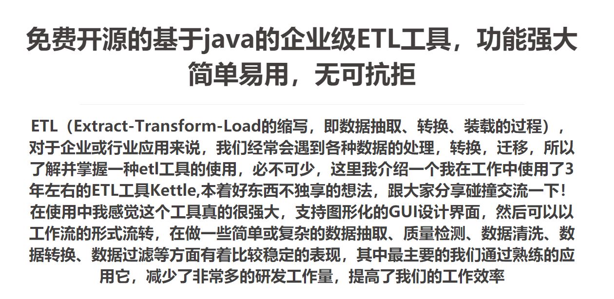
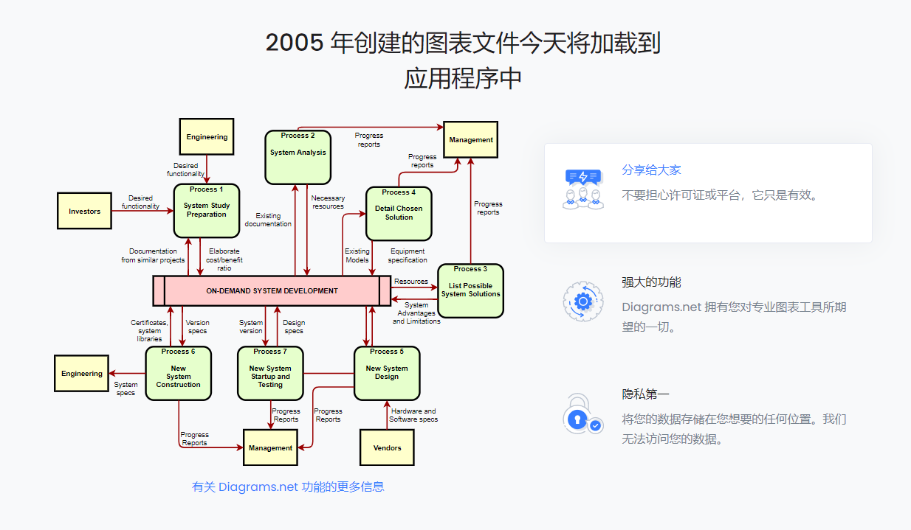

# 可能用到的办公软件

1.kettle

2.draw

图表绘制工具

3.axure rp

Axure RP是一款专业的快速原型设计工具。Axure（发音：Ack\-sure），代表美国Axure公司；RP则是Rapid Prototyping（[快速原型](https://baike.baidu.com/item/%E5%BF%AB%E9%80%9F%E5%8E%9F%E5%9E%8B/7432267)）的缩写。

Axure RP是美国Axure Software Solution公司旗舰产品，是一个专业的快速原型设计工具，让负责定义需求和规格、设计功能和界面的专家能够快速创建应用软件或Web网站的[线框图](https://baike.baidu.com/item/%E7%BA%BF%E6%A1%86%E5%9B%BE/7460023)、[流程图](https://baike.baidu.com/item/%E6%B5%81%E7%A8%8B%E5%9B%BE/206961)、原型和规格说明文档。作为专业的原型设计工具，它能快速、高效的创建原型，同时支持多人协作设计和版本控制管理 \[1\]  。

Axure RP的使用者主要包括[商业分析师](https://baike.baidu.com/item/%E5%95%86%E4%B8%9A%E5%88%86%E6%9E%90%E5%B8%88/6896629)、[信息架构师](https://baike.baidu.com/item/%E4%BF%A1%E6%81%AF%E6%9E%B6%E6%9E%84%E5%B8%88/4774481)、[产品经理](https://baike.baidu.com/item/%E4%BA%A7%E5%93%81%E7%BB%8F%E7%90%86/11013391)、IT咨询师、[用户体验设计师](https://baike.baidu.com/item/%E7%94%A8%E6%88%B7%E4%BD%93%E9%AA%8C%E8%AE%BE%E8%AE%A1%E5%B8%88/985005)、[交互设计师](https://baike.baidu.com/item/%E4%BA%A4%E4%BA%92%E8%AE%BE%E8%AE%A1%E5%B8%88/3329267)、[UI设计](https://baike.baidu.com/item/UI%E8%AE%BE%E8%AE%A1)师等，另外，架构师、[程序员](https://baike.baidu.com/item/%E7%A8%8B%E5%BA%8F%E5%91%98/62748)也在使用Axure
